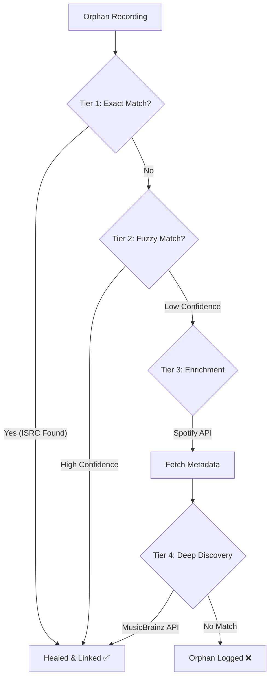

# Self-Healing Repertoire Engine 🎵🛠️

> **Autonomous Metadata Correction & High-Volume Revenue Recovery System**


---

## 🚀 The Mission

**Problem:** In the music industry, millions of dollars in royalties are lost every year because digital recordings are "orphaned"—they lack the metadata (ISRC/ISWC) linking them to their songwriters.

**Solution:** This engine automatically "heals" broken metadata by querying multiple external APIs in a smart, tiered "Waterfall" strategy. It turns unidentified audio files into monetizable assets.

---

## 🧠 The "Waterfall" Healer Architecture

Our core innovation is the **Multi-Tiered Healing Strategy**, designed to maximize match rates while minimizing API costs.



### How It Works:
1.  **Tier 1: Exact Match (ISRC)** 🎯
    *   Instant lookup in our local database or MusicBrainz using the unique ISRC code.
    *   *Speed:* < 10ms.

2.  **Tier 2: Fuzzy Matching (Levenshtein Distance)** 🔍
    *   Handles typos like "Shpe of You" vs "Shape of You".
    *   Uses intelligent string matching algorithms to find songs even with bad data.

3.  **Tier 3: External Enrichment (Spotify API)** 🎧
    *   **"The Smart Search"**: If we have a track name but no ISRC, we ask Spotify.
    *   Retrieves high-quality metadata, filling in the blanks for the next step.

4.  **Tier 4: Deep Discovery (MusicBrainz)** 🏛️
    *   Uses the refined data to find the **Work** (Composition) and **ISWC** (Writer's Code).
    *   Links the recording to the legal copyright, enabling payment.

---

## ⚡ Scalability & Performance

Designed for high-volume enterprise ingestion.

*   **Batch Processing**:Capable of ingesting and processing CSVs with thousands of rows in seconds.
*   **Asynchronous Architecture**: Healing jobs run in background threads (`CompletableFuture`), keeping the UI snappy.
*   **Resilience4j Integration**:
    *   **Circuit Breakers**: Prevents cascading failures if an external API goes down.
    *   **Rate Limiting**: Intelligent throttling ensures we never hit API bans (e.g., Spotify/MusicBrainz limits).
*   **Optimized Database**: Indexed PostgreSQL tables for sub-millisecond lookups on millions of records.

---

## 🛠️ Tech Stack

### Backend (Java / Spring Boot)
*   **Spring Data JPA**: For efficient ORM and database interactions.
*   **Resilience4j**: Fault tolerance library.
*   **OpenCSV**: High-performance CSV parsing.
*   **Lombok**: Wiring reduction.

### Frontend (React + Vite)
*   **Tailwind CSS**: Modern, utility-first styling.
*   **Lucide React**: Beautiful, consistent icons.
*   **Framer Motion**: Smooth UI transitions and animations.

---

## 🚦 Getting Started

### Prerequisites
*   Java 17+
*   Node.js 18+
*   PostgreSQL
*   MusicBrainz & Spotify API Credentials

### Installation

1.  **Clone the Repo**
    ```bash
    git clone https://github.com/your-username/self-healing-repertoire.git
    cd self-healing-repertoire
    ```

2.  **Configure Environment**
    Create `application.properties` or set env vars:
    ```properties
    DB_USERNAME=your_db_user
    DB_PASSWORD=your_db_password
    SPOTIFY_CLIENT_ID=your_id
    SPOTIFY_CLIENT_SECRET=your_secret
    ```

3.  **Run Backend**
    ```bash
    ./mvnw spring-boot:run
    ```

4.  **Run Frontend**
    ```bash
    cd frontend
    npm install
    npm run dev
    ```

---

## 📊 Impact

> *"Data is the new oil, but unrefined data is useless."*

This engine refines raw, broken music data into **gold**, directly impacting the bottom line for rights holders by ensuring every stream is properly attributed and paid.

---

*Built with ❤️ by Abhiram
